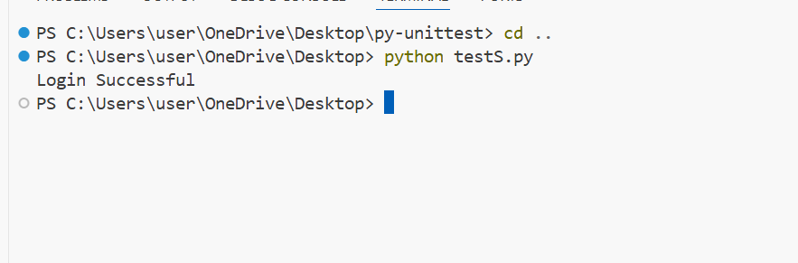

# Selenium-Basics

I automated the login process for OrangeHRM, a demo HR management website, using Selenium with Python.

What I did:

Opened the OrangeHRM website automatically.

Located the username and password input fields using Selenium locators (By.NAME).

Entered valid credentials (Admin / admin123).

Clicked the Login button programmatically.

Verified that the login was successful.

Implemented Explicit Waits to handle dynamically loading elements.

## Test Output

Below is the screenshot showing the result of running test.

